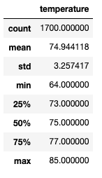
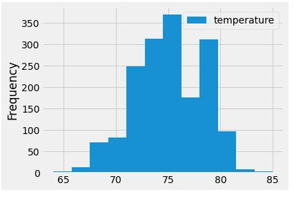
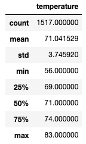
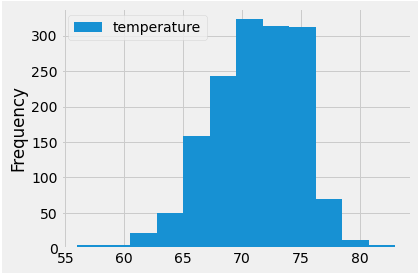

# surfs_up

## Overview
We have been asked by our investor client Mr. W. Avy to provide two additional month-specific analyses (June & December) from our weather data of Oahu to provide support for our plan to open our Surf & Ice Cream shop. These two months (mid summer and mid winter) should help establish whether or not our business plan will be viable year round.

## Results
Oahu - June:

Oahu - December

* Based on our available dataset of six years (2010 - 2016), the two months have remarkably similar temps for being in two opposite "seasons". 

* Both months have a roughly 4-5 degree 25th-75th interval, centered around an average temp in the low to mid-70's. December is slightly cooler, as is appropriate for winter, but only by a couple degrees.

* While December does have the potential for some lower temp days, the vast majority of the days in both months should be in the 65-80F range, suitable for both surfing and ice cream consumption.

## Summary

As noted above, this analysis continues to support our business plan. However, temp is only one aspect. It would probably be useful to combine this with our previous precipitation analysis. It might also be useful to break the data down by station, just in case there is any station-specific bias that may be muddying the data (for example, a station located at a higher altitude that consistently reports lower temps than other stations for the same day).